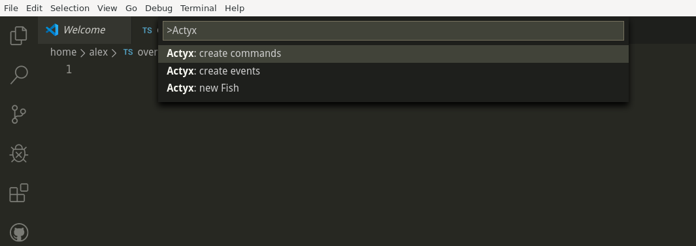
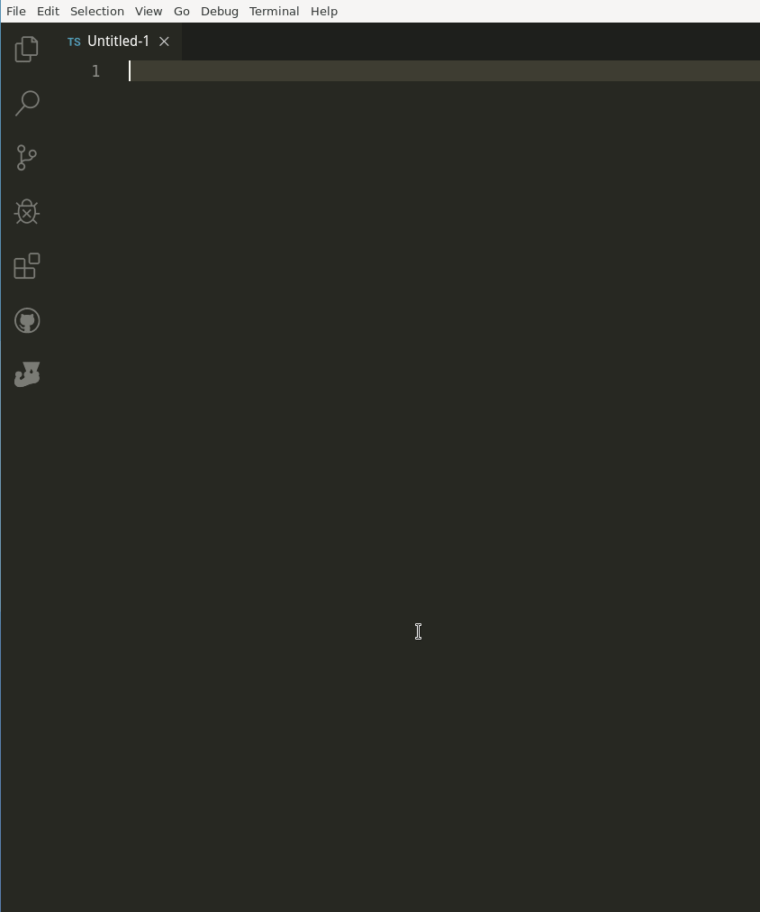

# Actyx Pond

The Actyx Pond vscode extension will power up your development speed dramatically. Create new fishes in seconds, and define your commands and events from a high level syntax.

## Features

Create this extension contributes tree new commands:

* `Actyx: new fish`: overwrite the current file with a new fish definition
* `Actyx: create events`: convert the *selected* events to a event definition and add it to the onEvent function
* `Actyx: create commands`: convert the *selected* command to a command definition and add it to the onCommand function



### `Actyx: new fish`: Create a new fish definition

Open a new file and run the `Actyx: new fish` in `Ctrl+Shift+P`. This will ask you for a fish name and try to overwrite the content of the active document. To avoid conversions, use a fish name like `/[a-z_]/i`

### `Actyx: create events`: Define events for the fish

A event is the communication channel for the distributed system to share facts between the edge nodes. To build on a type save infrastructure, some type definition is required. To reduce the load of typing, the definition can be generated with `Actyx: create events`

The syntax:

```typescript
// no parameters
eventName
// parameters
eventName(parameter: type)
eventName(parameter: type, para...)
```

### `Actyx: create commands`

A command is the way to communicate with the local fishes on your edge nodes. To communicate on a type save infrastructure, some type definition is required. To reduce the load of typing, the definition can be generated with `Actyx: create commands`

The syntax:

```typescript
// no parameters
commandName
// parameters
commandName(parameter: type)
commandName(parameter: type, para...)
```

## How it works



## Release notes

### known issues

Currently, there are only single line types supported. Multi line types will fail by creating them automatically. You can add them later in the definition or use types to define this data structures  

```typescript
// not supported:
eventName(
  parameter: {
    name: string,
    value: number
  },
  para....)

// supported:
assignActivity(worker: Worker, activity: Activity)
```

### 0.1.4

* LF and CRLF compatible
* lazy/incomplete selection is now supported
* auto save after new Fish

### 0.1.0

Initial release of

* `new fish`
* `create events`
* `create commands`
